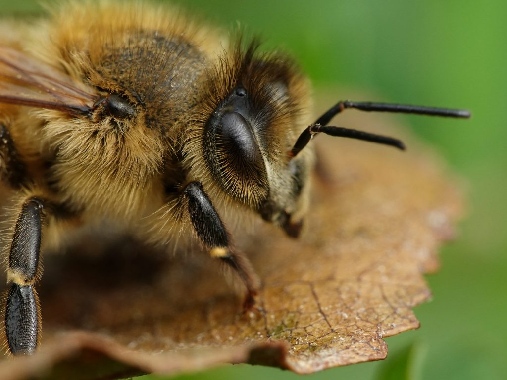

Of course. Here is a `README.md` generated with the "Editor IDE Bee Script Max Thoughts" persona, incorporating your specified project name and directory structure with a tree icon representation.



***

```markdown
# 🐝 IVBIDAUS

*An Intelligent, Versioned, Bee-inspired, Distributed, Autonomous, Universal System.*

[](https://github.com/your-user/ivbidaus/actions)
[](https://opensource.org/licenses/MIT)
[](./package.json)
[](https://discord.gg/your-invite)

> **Max Thought:** This project isn't just a codebase; it's a digital ecosystem. Each module, or "honeycomb," is designed for maximum autonomy yet contributes to the collective intelligence of the "hive." The goal is a self-organizing, resilient system where code, data, and logic flow like pollen between flowers.

## 💡 Core Philosophy

**IVBIDAUS** operates on a simple yet powerful principle: **decentralized cohesion**. Inspired by the emergent behavior of a bee colony, the system is architected as a collection of specialized, independent services and applications that communicate through a well-defined API "nectar." This approach allows for massive scalability, fault tolerance, and independent development cycles for each component.

## 🌳 The Hive Layout (Project Structure)

Here is a view of the project's monorepo structure. Each top-level directory represents a primary function within the ecosystem.


./ivbidaus/
├── 🌳 App/
│   ├── core/               # Core business logic, shared across platforms
│   ├── modules/            # Feature-specific, pluggable modules
│   └── services/           # Application-level services (e.g., caching, state)
├── 🌳 Client/
│   ├── cli/                # Command-line interface tool
│   └── mobile/             # (Future) Mobile application source
├── 🌳 Desktop/
│   ├── main/               # Electron/Tauri main process
│   ├── preload/            # Scripts to inject into webviews
│   └── renderer/           # UI components specific to the desktop shell
├── 🌳 Doc/
│   ├── api/                # Generated API documentation
│   ├── architecture/       # System design and ADRs (Architecture Decision Records)
│   └── guides/             # User and developer guides
├── 🌳 Image/
│   ├── icons/              # Application and file-type icons
│   ├── logo/               # Project branding assets
│   └── screenshots/        # UI captures for documentation
├── 🌳 Servers/
│   ├── api-gateway/        # Main entry point for all client requests
│   ├── auth-service/       # Handles user authentication and authorization
│   ├── data-worker/        # Background processing and data ingestion
│   └── realtime-service/   # WebSocket / real-time communication hub
├── 🌳 Web/
│   ├── components/         # Reusable UI components (React/Vue/Svelte)
│   ├── hooks/              # Custom hooks for state management
│   ├── pages/              # Top-level page routes
│   └── styles/             # Global styles and themes
├── .editorconfig
├── .gitignore
├── LICENSE
├── package.json            # Monorepo root package
└── README.md               # You are here.


## 🚀 Getting Started

To get the development environment running, you'll need a few prerequisites. The hive relies on Node.js and Docker for orchestration.

### Prerequisites

*   Node.js (v18.x or later)
*   pnpm (for monorepo workspace management)
*   Docker & Docker Compose

### Installation & Setup

1.  **Clone the repository:**
    ```bash
    git clone https://github.com/your-user/ivbidaus.git
    cd ivbidaus
    ```

2.  **Install dependencies from the root:**
    *The `pnpm` workspace protocol will automatically link all local packages (`App`, `Servers`, `Web`, etc.).*
    ```bash
    pnpm install
    ```

3.  **Start the backend services:**
    *This script will use Docker Compose to spin up the necessary server containers.*
    ```bash
    pnpm run servers:up
    ```

4.  **Run the development environment:**
    *This concurrently starts the Web, Desktop, and any other watch processes.*
    ```bash
    pnpm run dev
    ```

## ⚙️ Available Scripts

The root `package.json` contains orchestrator scripts for managing the entire hive.

| Script                | Description                                                |
| --------------------- | ---------------------------------------------------------- |
| `pnpm install`        | Installs all dependencies across all workspaces.           |
| `pnpm dev`            | Starts all development servers (Web, Desktop) concurrently.|
| `pnpm build`          | Builds all production-ready applications.                  |
| `pnpm test`           | Runs all unit and integration tests across the monorepo.   |
| `pnpm lint`           | Lints and formats all code according to project rules.     |
| `pnpm servers:up`     | Starts the Dockerized backend services.                    |
| `pnpm servers:down`   | Stops and removes the Dockerized backend services.         |
| `pnpm doc:generate`   | Generates fresh API documentation from source code.        |

## ✨ Contributing

Contributions are the lifeblood of the hive! Whether you're fixing a bug, proposing a new feature, or improving documentation, your work is valued. Please read our `CONTRIBUTING.md` guide to get started.

High-level process:
1.  Fork the repository.
2.  Create a new feature branch (`git checkout -b feature/nectar-collector`).
3.  Commit your changes (`git commit -m 'feat: add new nectar collector'`).
4.  Push to your branch (`git push origin feature/nectar-collector`).
5.  Open a Pull Request.

---

Crafted by the **IVBIDAUS Hive Mind**
```